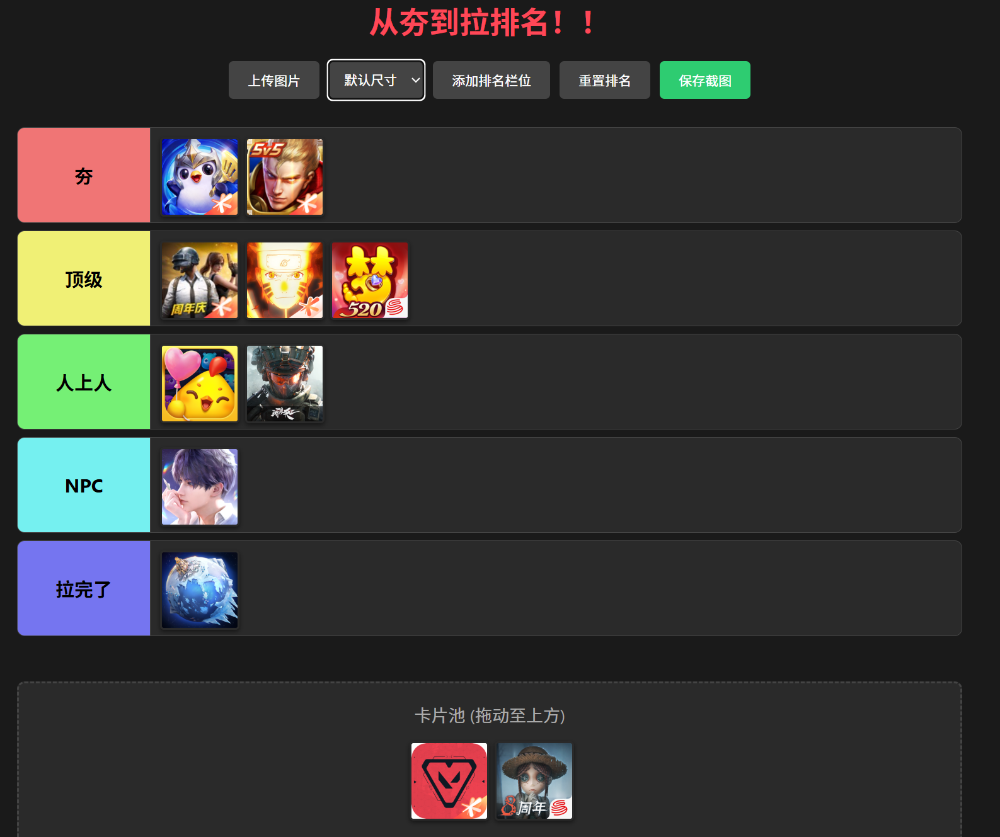

# 从夯到拉排名工具

这是一个通用的强度排名创建工具，支持自定义排名栏位、拖拽卡片以及导出截图，适用于任何需要进行“从夯到拉”评级的场景。

## 🌐 在线体验
您可以直接访问以下地址使用该工具：
[https://ranktool.baoxin1100.top](https://ranktool.baoxin1100.top)

## 📸 使用演示

## ✨ 功能特性
- **自定义栏位**：自由添加、重命名排名等级（如：夯、顶级、NPC、拉完了等）。
- **拖拽排序**：通过简单的拖拽将图片卡片分配至不同等级。
- **尺寸可调**：支持小、中、大三种图片尺寸，且可实时同步更新所有已上传图片。
- **导出截图**：一键将当前的排名结果保存为高清图片。

## 🛠️ 技术栈
- HTML5
- CSS3
- JavaScript (ES6+)
- html2canvas (用于截图)